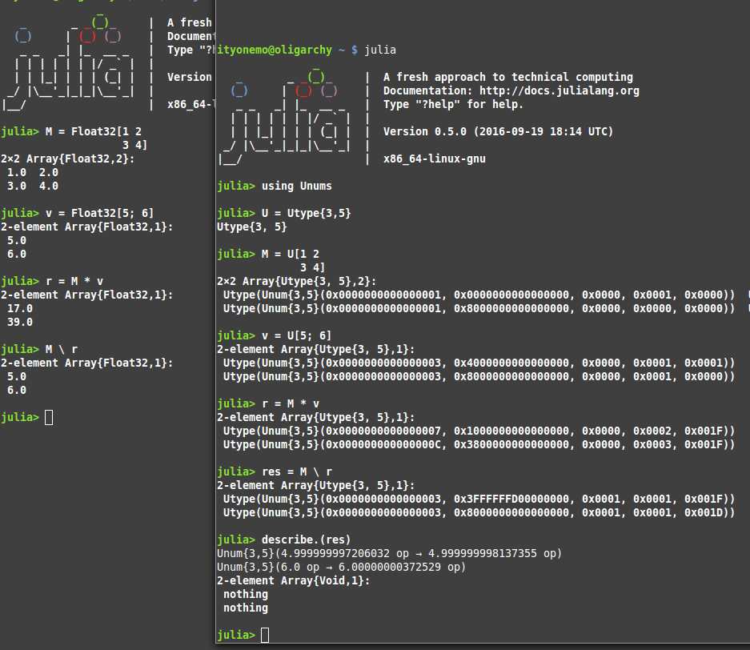

Milestone 1
===========

work summary:

* redo the "Utype" mechanism to be a boxing type around Unum and Ubound types

Completed, 3 Jan 2017.  Ran initial tests on the some matrix multiplication and
solving problems.  Uncovered mathematical inaccuracies in the results for a
basic matrix solving problem.  Formulated a plan for solving the inverted matrix
problem.

unumjl library commits:
ad07e8712a038fde3a31cc41d4414f1ea9595413 -> 239b4da1d14bc05b6347c24edd9fa0ba61c00300

* repaired problems with matrix inversion.

involved reverting multiplication and subtraction to "pre-heuristic" methods.
will revisit using heuristic methods later.

unumjl library commits:

239b4da1d14bc05b6347c24edd9fa0ba61c00300 -> 0449d871839920c2b8238a7e2277cf7208129400

further problems with basic unum operations discovered and repaired.

0449d871839920c2b8238a7e2277cf7208129400 -> -> e771eff146a283df130f738c1393521b13e42668

* work on the ubox method

update the ubox method so that it now works with the boxed "Utype" values
